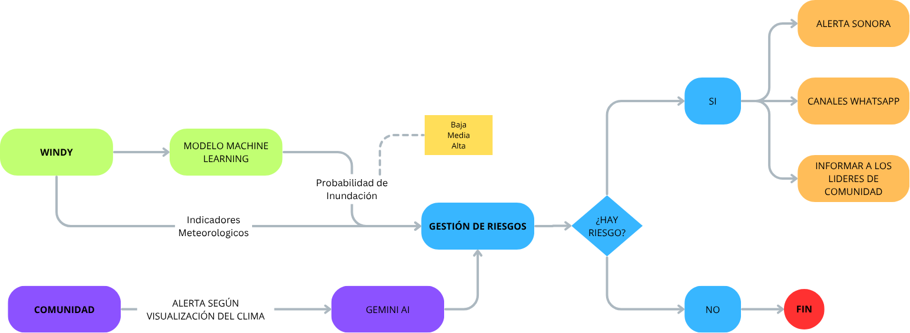
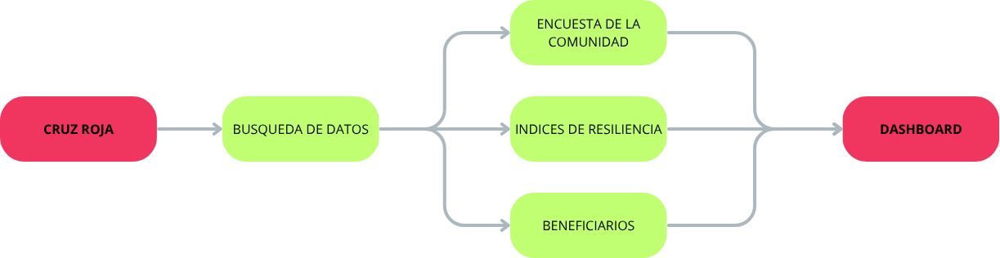
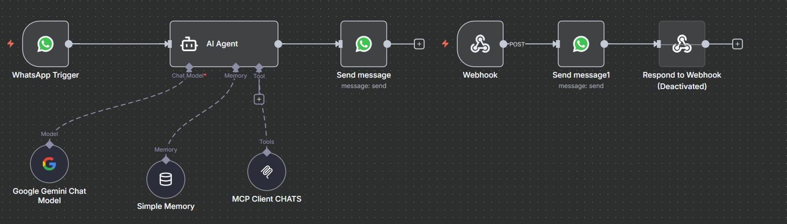
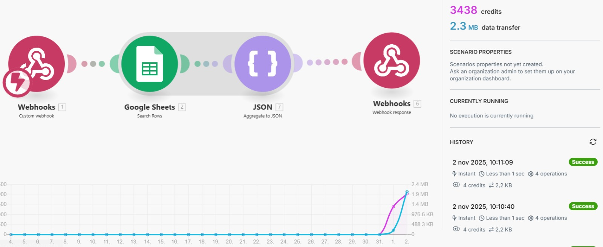
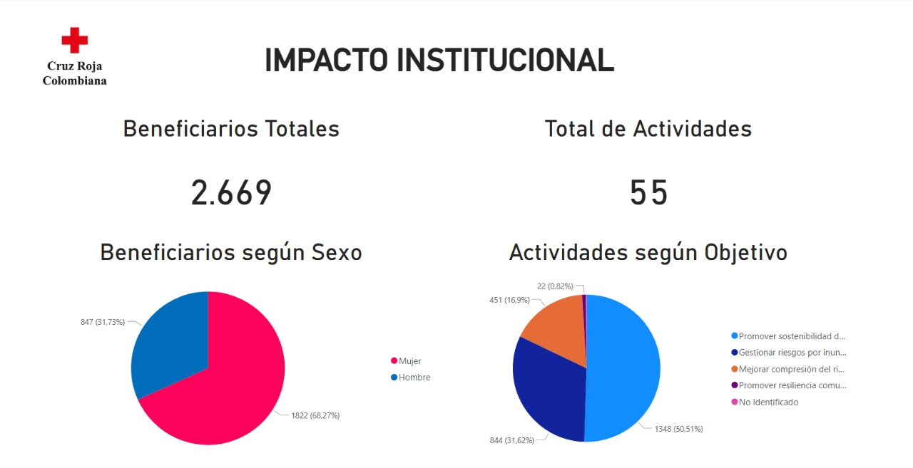
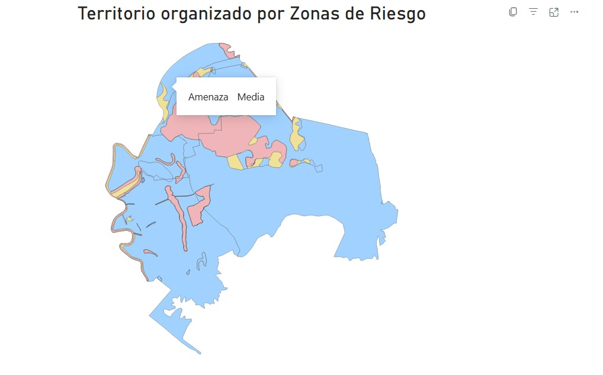
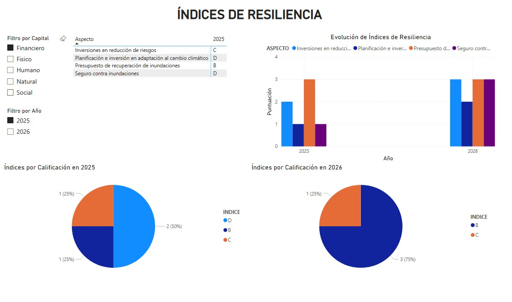
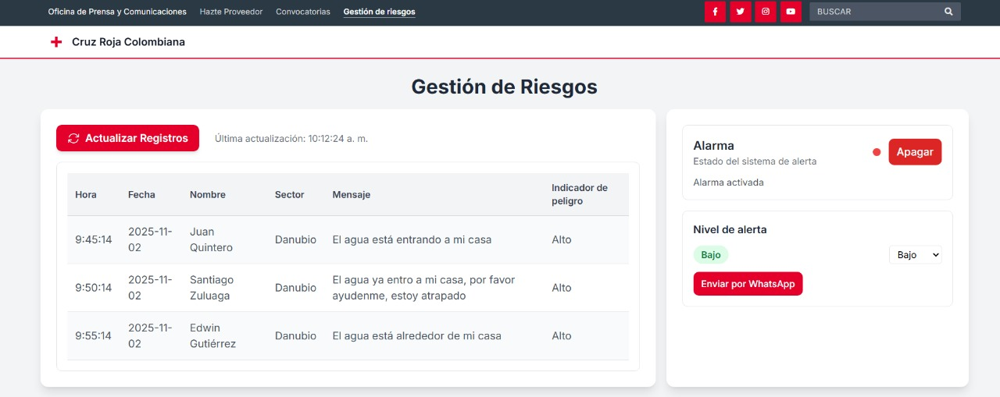
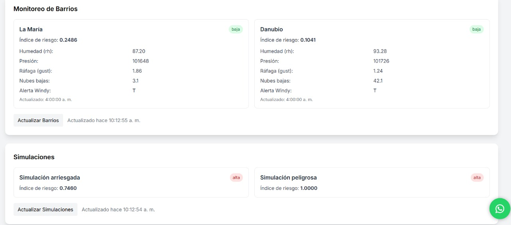

# Ficha Técnica Bytes&Bits 🚀

Sistema de Mitigación de Sufrimiento Humano

## Descripción de la Solución

Solución tecnológica desarrollada para fortalecer el trabajo preventivo de la Cruz Roja antes de que ocurran los desastres. El proyecto integra tres desarrollos clave: un dashboard inteligente que visibiliza las acciones humanitarias en tiempo real, un sistema de comunicación ciudadana vía WhatsApp con inteligencia artificial para validar reportes locales, y un modelo predictivo que anticipa riesgos meteorológicos y activa alertas tempranas. Al combinar la voz de la comunidad con herramientas predictivas, se logra una gestión más precisa, eficiente y humana. 

## Nivel de desarrollo

Prototipo funcional

## Link al video

[Video de la solución](https://youtu.be/uHioTsPEx6Y)

## Link a la presentacion

[Presentación](https://www.canva.com/design/DAG3gSqScbo/mcevxCIgqRT_7IQdeAho4w/edit)

## Ventajas o fortalezas de nuestra propuesta

**Visibilización del trabajo preventivo:** El dashboard permite mostrar en tiempo real las acciones de la Cruz Roja, fortaleciendo la confianza comunitaria y la transparencia institucional.

**Información verificada desde el territorio:** El canal ciudadano con IA permite recibir reportes directos desde zonas afectadas, clasificados automáticamente para una respuesta más precisa.

**Activación de alertas tempranas:** El modelo predictivo cruza datos meteorológicos con reportes ciudadanos para anticipar riesgos y activar alarmas automáticas.

**Reducción del sufrimiento humano:** La combinación de prevención y tecnología permite actuar antes de la emergencia, salvando vidas y mitigando daños.

**Escalabilidad y replicabilidad:** El sistema puede adaptarse a otras regiones, tipos de riesgo o instituciones humanitarias, ampliando su impacto.

## Desventajas o debilidades de nuestra propuesta

**Dependencia tecnológica:** El funcionamiento del canal ciudadano depende de conectividad y acceso a dispositivos móviles, lo que puede limitar su alcance.

**Adopción comunitaria:** La participación ciudadana es clave, por lo que se necesita una estrategia de sensibilización y formación para garantizar el uso del canal de reporte.

## Detalles técnicos

**Tecnologías utilizadas:** Scikit-learn, Power BI, Make, N8N, Meta API, Gemini API.

## Alcance del prototipo

El prototipo actual demuestra cómo la tecnología puede potenciar el trabajo preventivo de la Cruz Roja, integrando tres componentes funcionales que ya permiten simular escenarios reales de gestión de riesgos:

- **Predicción de riesgos meteorológicos**: El sistema utiliza un modelo de Machine Learning entrenado con variables climáticas básicas para anticipar lluvias intensas y posibles inundaciones. Aunque el modelo es sencillo, permite validar la lógica de predicción y activar alertas tempranas en función de datos reales.

- **Canal ciudadano con IA**: Se ha desarrollado un agente conversacional vía WhatsApp que recibe reportes de la comunidad, los analiza y los clasifica automáticamente. Actualmente está en fase de pruebas internas, pero ya permite simular la recepción, validación y priorización de información desde el territorio.

- **Dashboard preventivo**: El tablero inteligente muestra actividades como capacitaciones, brigadas e índices. Aunque requiere la carga manual de documentos para actualizar la información, permite visualizar el impacto preventivo de la Cruz Roja y fortalecer la conexión con la comunidad.

- **Integración funcional entre módulos**: Los tres desarrollos están conectados, permitiendo que los reportes ciudadanos y las predicciones meteorológicas se combinen para activar alertas automáticas.

## **Flujo de Datos**

## Imágenes de Prototipo Funcional Canal WhatsApp

## Imágenes de Prototipo Funcional Dashboard

## Imágenes de Prototipo Funcional Alarmas

## Link al Repositorio de la Solución

https://github.com/NicolasOrtiz05/HackatonBytes-Bits.git
